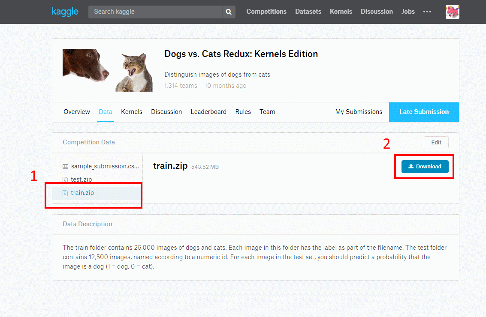

# Inception-BN

This sample is what is ported from https://github.com/apache/incubator-mxnet/blob/master/cpp-package/example/inception_bn.cpp to C#. 

BN means 'Batch Normalization'

## How to use?

## 1. Build project

````
cd <InceptionBN_dir>
dotnet build --configuration Release
````

At last, copy ***libmxnet.dll*** and dependencies to output directory; &lt;InceptionBN_dir&gt;\bin\Release\netcoreapp2.0.

## 2. Download demo data

Download train data from [Dogs vs. Cats Redux: Kernels Edition](https://www.kaggle.com/c/dogs-vs-cats-redux-kernels-edition/data) on **Kaggle**.  
To download test data, you must create account of Kaggle.  
After login, go to avobe page and download it.



After download, downaloded file move to **<InceptionBN_dir>**.

## 3. Setup data

### Prepare

If you did not install OpenCV for Python, execute the following command.

````
python -m pip install opencv-python
````

### Create train and test data

At first, you MUST build and copy dependency libraries to **<InceptionBN_dir>\bin\Release\netcoreapp2.0**

````
cd <InceptionBN_dir>
setup.bat
````

## 4. Run

````
cd <InceptionBN_dir>
dotnet run --configuration Release
````

## 5. Others

### Use CPU

If you want to use CPU, change the following code, build and run!!

````
// change device type if you want to use GPU
var context = Context.Cpu();
````

### Program does NOT exit!!

Please refer [C++ demo memory release problem](https://github.com/apache/incubator-mxnet/issues/7973)